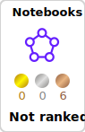
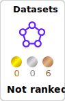

# Hello, everyone! 

Md. Fahim Bin Amin is a versatile and accomplished software engineer, educator, and open-source advocate who has made a significant impact in the world of technology. His contributions to the developer community, through his writing, video content, and mentoring, have earned him a well-deserved reputation as a leader in his field.

 

---

### Kaggle Status

<!-- 

  
  

 -->

<!-- 
 -->

  
  

---

### YouTube & GitHub

       
       
      
      
   

---

### 📺 Latest YouTube Videos

<!-- BEGIN YOUTUBE-CARDS -->
[ On Windows Operating System")](https://www.youtube.com/watch?v=A45lWrndVHA)

<!-- END YOUTUBE-CARDS -->

